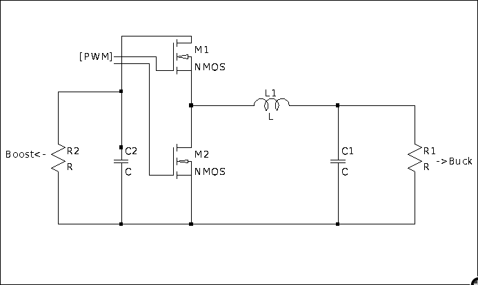
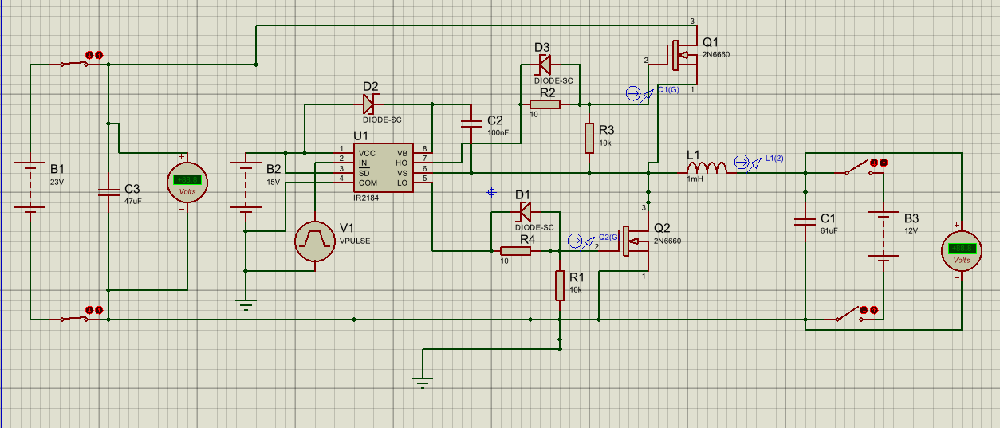
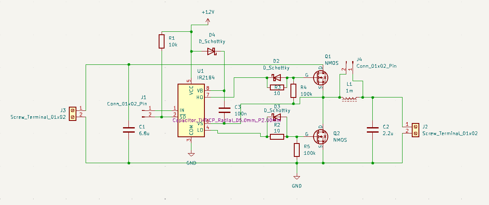

# Bidirectional Buck DC-DC Converter

This repository documents the design and implementation of a **bidirectional DC-DC converter**.  
The system can operate in both **buck mode** (step-down) and **boost mode** (step-up), enabling power flow in both directions.  

---
## Sofware used
- **Simulation**
  
   Multisim, Ltspice and MATLAB/Simulink
- **PCB**
  
   Kicad
## 📐 Specifications
- **Switching frequency**: 60 kHz  
- **Maximum power**: 5 W  

### Buck Mode
- $V_{in, min} = 23V$  
- $V_{out, max} = 14V$  

### Boost Mode
- $V_{in, min} = 12V$  
- $V_{out, max} = 27V$  

---

## 🔌 Topology
The selected topology is based on a **bidirectional synchronous buck/boost converter**.  
Diagram (preliminary):  

---

## 📊 Design Parameters
### Inductor
- To be dimensioned based on:  
 $L = \frac{V_L \cdot D}{\Delta I_L \cdot f_s}$
  where:
  - \( $V_L$ \) = inductor voltage  
  - \( $D$ \) = duty cycle  
  - \( $\Delta I_L$ \) = current ripple (≈ $30$% of \( $I_{L,max}$ \))  
  - \( $f_s$ \) = switching frequency  

### Capacitor
- To be dimensioned from capacitor current balance:
- buck
  $C = \frac{\Delta I_L}{\Delta V \cdot f_s\cdot 8}$
- boost
  $C = \frac{I_{out} \cdot D}{\Delta V \cdot f_s}$
  
  where:
  - \( $\Delta V$ \) = allowed voltage ripple  

## Simulation/PCB layout
-Proteus

  

-Kicad

  

---

## ✅ TODO 
- [ ] Component selection  
- [ ] PCB design and layout  
- [ ] Firmware integration (ESP32 control)  
- [ ] Experimental validation
---

## 👥 Collaborators
- **[Agustín Torres](\ https://github.com/aguscsc \)**  
- **[Ignacio Cerda](\ https://github.com/LovesCharlie \)**  
- **[Gian Luca Barbagelata](\ https://github.com/Yian-n \)**  

---

## 📚 References
-   Mohan – Power Electronics, Cap. 7
-   Erickson – Fundamentals of Power Electronics, Cap. 3
-   Power Electronics: Converters, Applications, and Design” – Ned Mohan
-   Electronica de Potencia, 1era edicion - Daniel W.Hart
