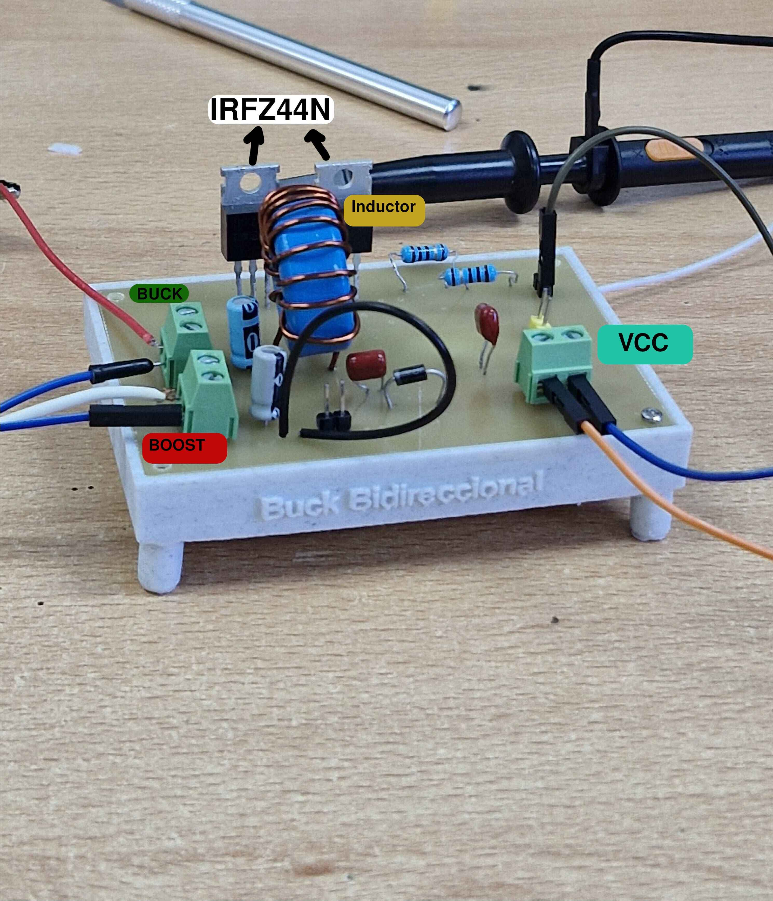
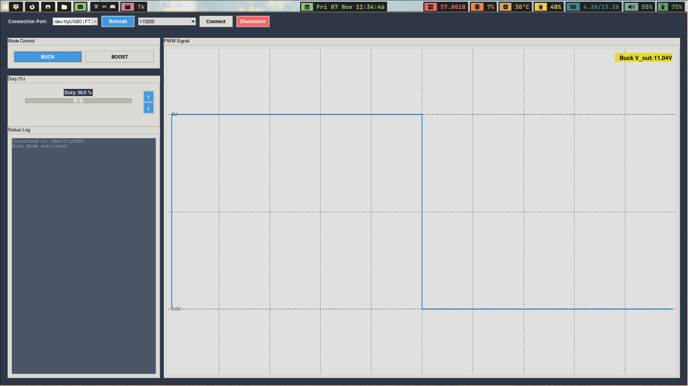
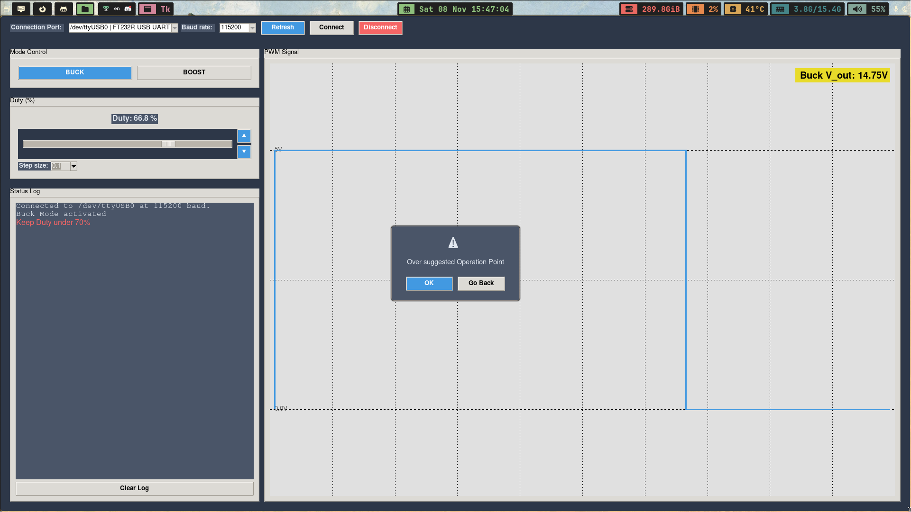

# Bidirectional Buck DC-DC Converter

This repository documents the design and implementation of a **bidirectional DC-DC converter**.  
The system can operate in both **buck mode** (step-down) and **boost mode** (step-up), enabling power flow in both directions.  

---
## Software used
- **Simulation**
  
   Multisim, Ltspice and MATLAB/Simulink
   coil64
- **PCB**
  
   Kicad
## 📐 Specifications
- **Switching frequency**: 60 kHz  
- **Maximum power**: 5 W  

### Buck Mode
- $V_{in, min} = 23V$  
- $V_{out, max} = 14V$  

### Boost Mode
- $V_{in, min} = 12V$  
- $V_{out, max} = 27V$  

---

## 🔌 Topology
The selected topology is based on a **bidirectional synchronous buck/boost converter**.  
Diagram (preliminary):  


---

## 📊 Design Parameters
### Inductor
- To be dimensioned based on:  
 $L = \frac{V_L \cdot D}{\Delta I_L \cdot f_s}$
  where:
  - \( $V_L$ \) = inductor voltage  
  - \( $D$ \) = duty cycle  
  - \( $\Delta I_L$ \) = current ripple (≈ $30$% of \( $I_{L,max}$ \))  
  - \( $f_s$ \) = switching frequency
  
   $I_{sat} = \frac{B_{sat}\cdot l}{\mu_{0}\cdot \mu_{r}\cdot N}$
  Where:
  - \($I_{sat}$\) = Saturation current
  - \($B_{sat}$\) = saturation flux density of the core material
  - \($l$\) = effective magnetic path length of the core
  - \($\mu_{0}$\) = permeability of a vacuum
  - \($\mu_{r}$\) = relative permeability of the material
  - \($N$\) = number of turns

Recommendation: use coil64 to check your calculations, research skin effect and how different AWG interact with the frequency you're using (https://en.wikipedia.org/wiki/Skin_effect).
### Capacitor
- To be dimensioned from capacitor current balance:
- buck
  $C = \frac{\Delta I_L}{\Delta V \cdot f_s\cdot 8}$
- boost
  $C = \frac{I_{out} \cdot D}{\Delta V \cdot f_s}$
  
  where:
  - \( $\Delta V$ \) = allowed voltage ripple  

## Schematic & PCB layout
<p>
  
</p>

<p>
  
</p>

---
# Prototyping 
This section breaks down the process of prototyping and testing, the pcb in the design directory contains all the measures necessary to ensure the converter is working properly (value of components can be adjusted to your needs).
## BOM:
- 2 electrolytic capacitors $6.8\mu F$ and $2.2\mu F$ 50V each. 
- 2 ceramic capacitors (100nF).
- core T106-26 + 9m of AWG 26 wire (higher permeability would also work if the saturation stays sensible).
- 2 IFRZ44N (great for prototyping and testing)
- IR2184 driver (it can generate both MOSFET signals)
- 2 10 ohm gate resistors 1W (it limits the gate current)
- 2 10k ohm pull-down resistor 1W (drains the gate source capacitance)
 
## Measurements and tests
### switching
First, you ought to make sure the MOSFET are switching correctly. For this, turn on the pwm signal and your VCC source, then measure the gate-source pins of each MOSFET with an oscilloscope and make sure the signals are the complement of each other and respond to the change in duty. Aditionally, you should measure the gate current to ensure it is not exceeding the drivers capacity.
<p>
  
</p>

### Powering the circuit
Check the waveforms of the inductor current and output voltage, ideally you should be looking at two saw-like waves with minimal ripple.

Once you have ensured the inductor current and the output voltage have satisfied your needs you can proceed to measure the converters effiency for each mode.

Note: if you struggle achieving the voltage ripple required, considering soldering ceramic capacitors parallel to your current ones.
### Efficiency 
**BUCK** R = $39.8$

| Duty | $V_{in}$ | $I_{in}$ | $V_{out}$ | $P_{in}$ | $P_{out}$ | Efficiency |
|:----:|:---------:|:---------:|:----------:|:---------:|:----------:|:-----------:|
| 35%  | 23 V | 0.06 A | 7.26 V | 1.38 W | 1.32 W | 96.4 % |
| 45%  | 23 V | 0.10 A | 9.45 V | 2.30 W | 2.24 W | 97.5 % |
| 55%  | 23 V | 0.16 A | 11.6 V | 3.68 W | 3.38 W | 91.8 % |
| 65%  | 23 V | 0.22 A | 13.78 V | 5.06 W | 4.77 W | 94.3 % |


**BOOST** R = $142.2$

| Duty | $V_{in}$ | $I_{in}$ | $V_{out}$ | $P_{in}$ | $P_{out}$ | Efficiency |
|:----:|:---------:|:---------:|:----------:|:---------:|:----------:|:-----------:|
| 29.5%  | 12 V | 0.16 A | 16.34 V | 1.92 W | 1.87 W | 97.7 % |
| 39.5%  | 12 V | 0.21 A | 18.79 V | 2.52 W | 2.48 W | 98.5 % |
| 49.5%  | 12 V | 0.30 A | 22.11 V | 3.60 W | 3.43 W | 95.4 % |
| 59.5%  | 12 V | 0.46 A | 26.77 V | 5.52 W | 5.04 W | 91.3 % |

# PWM control
Previously, the pwm signal was generated with a waveform generator, for real applications this has to be implemented with a microcontroller, in this case we'll use a PIC32 to generate the pwm signal.
This section will cover the programming and testing of the control system and its integration with the power circuit.

## Prototyping

First the [Curiosity PIC32MZEF2](Datasheets/PIC32/Curiosity_PIC32MZEF2.0_Development_Board_Users_Guide_DS80005400A.pdf) board was used to program and debug the pic32, this board comes equipped with a PICKit on board 4 to program and the debug the microcontroller using [MPLABX](https://www.microchip.com/en-us/tools-resources/develop/mplab-x-ide).

To ensure the correct operation of the microcontroller, first it was configured to control the PWM signal via the analog to digital converter, mapping its input to duty cycle levels. The steps followed were:


```
+-----------------------+      +-----------------------+      +-----------------------+      +-----------------------+
|     Start: Create     |      |     Config Output     |----->|      Config Timer     |      |     End: Compile &    |
|  PWM Generation Code  |      |    Compare I/O Pins   |      |        Registers      |      |   Load Code to PIC32  |
+-----------------------+      +-----------------------+      +-----------------------+      +-----------------------+
            |                              ^                              |                              ^
            |                              |                              |                              |
            v                              |                              v                              |
+-----------------------+      +-----------------------+      +-----------------------+      +-----------------------+
|   Config Oscillator   |----->|     Config Output     |      |       Config the      |----->|     Init Remaining    |
|         & PLL         |      |     Compare Module    |      |           ADC         |      |    I/O & Peripherals  |
+-----------------------+      +-----------------------+      +-----------------------+      +-----------------------+
```
First, it is necessary to generate the system clock, to do this the POSC (primary Oscillator) was set to EC mode, generating a 12Mhz signal which was scaled using the PLL [data_sheets](/microcontroller/Datasheets), then feeding a voltage signal controlled with a potentiometer to the ADC the pwm signal was generated. 

Once peripherals were working as expected, a graphic interface was integrated to replace the potentiometer, allowing for control over the mode, duty and frequency at which the converter operated.


# Graphical Interface
To control the microcontroller used for the PWM signal, a graphical interface is designed, the criteria followed for the design were:

- Intuitive
- Easy to switch between modes
- Secure, it must limit human error as much as possible without harming the user's experience
- Use of non distracting colors
- It must have a visual representation of the signal and voltage output

To develop such interface the language chosen is Python, due to the presence of the library [Tkinter](https://docs.python.org/es/3/library/tkinter.html), which made the process a lot easier.

Here you can see the interface next to an example of a warning popup when going above the suggested operation point.
<p>
  
</p>

<p>
  
</p>

## How to use

### Executable
  
In [here](/microcontroller/graphic_interface/executables) you will find executables to run on your machine (Linux and Windows are currently supported).

### Manual

**1. Clone the repository**

```
git clone https://github.com/aguscsc/Bidirectional-Buck-DC-DC-converter.git
cd Bidirectional-Buck-DC-DC-converter/microcontroller/graphic_interface
```

**2. Dependencies**

```
pip install pyserial
```

**3. Run gui.py**

```
python gui.py
```

**Spanish version**

```
python es_gui.py
```
## ✅ TODO   
- [ ] Firmware integration (ESP32 control)
- [ ] Final PCB
- [ ] Experimental validation
---

## 👥 Collaborators
- **[Agustín Torres](https://github.com/aguscsc)**  
- **[Ignacio Cerda](https://github.com/LovesCharlie)**  
- **[Gian Luca Barbagelata](https://github.com/Yian-n)**  

---

## 📚 References
-   Mohan – Power Electronics, Cap. 7
-   Erickson – Fundamentals of Power Electronics, Cap. 3
-   Power Electronics: Converters, Applications, and Design” – Ned Mohan
-   Electronica de Potencia, 1era edicion - Daniel W.Hart
