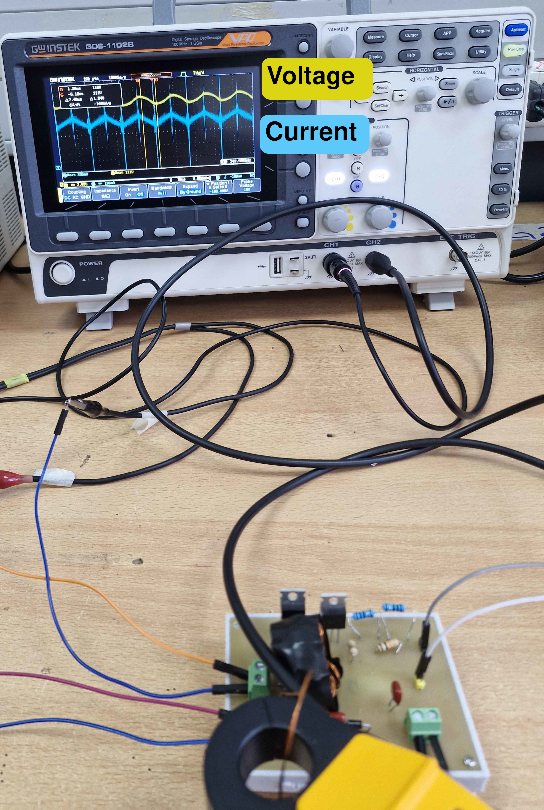

# Bidirectional Buck DC-DC Converter

This repository documents the design and implementation of a **bidirectional DC-DC converter**.  
The system can operate in both **buck mode** (step-down) and **boost mode** (step-up), enabling power flow in both directions.  

---
## Software used
- **Simulation**
  
   Multisim, Ltspice and MATLAB/Simulink
   coil64
- **PCB**
  
   Kicad
## 📐 Specifications
- **Switching frequency**: 60 kHz  
- **Maximum power**: 5 W  

### Buck Mode
- $V_{in, min} = 23V$  
- $V_{out, max} = 14V$  

### Boost Mode
- $V_{in, min} = 12V$  
- $V_{out, max} = 27V$  

---

## 🔌 Topology
The selected topology is based on a **bidirectional synchronous buck/boost converter**.  
Diagram (preliminary):  

---

## 📊 Design Parameters
### Inductor
- To be dimensioned based on:  
 $L = \frac{V_L \cdot D}{\Delta I_L \cdot f_s}$
  where:
  - \( $V_L$ \) = inductor voltage  
  - \( $D$ \) = duty cycle  
  - \( $\Delta I_L$ \) = current ripple (≈ $30$% of \( $I_{L,max}$ \))  
  - \( $f_s$ \) = switching frequency
  
   $I_{sat} = \frac{B_{sat}\cdot l}{\mu_{0}\cdot \mu_{r}\cdot N}$
  Where:
  - \($I_{sat}$\) = Saturation current
  - \($B_{sat}$\) = saturation flux density of the core material
  - \($l$\) = effective magnetic path lenght of the core
  - \($\mu_{0}$\) = permeability of a vacuum
  - \($\mu_{r}$\) = relative permeability of the material
  - \($N$\) = number of turns

Recomendation: use coil64 to check your calculations.
### Capacitor
- To be dimensioned from capacitor current balance:
- buck
  $C = \frac{\Delta I_L}{\Delta V \cdot f_s\cdot 8}$
- boost
  $C = \frac{I_{out} \cdot D}{\Delta V \cdot f_s}$
  
  where:
  - \( $\Delta V$ \) = allowed voltage ripple  

## Schematic & PCB layout

  

  

---
# Prototyping 
This section breaks down the process of prototyping and testing, the pcb in the design directory contains all the mesaures necessary to ensure the converter is working properly (value of components can be adjusted to your needs).
## BOM:
- 2 electrolytic capacitors $6.8\mu F$ and $2.2\mu F$ 50V each. 
- 2 ceramic capacitors (100nF).
- core T106-26 + 9m of AWG 26 cable (higher permeability would also work if the saturation stays sensible).
- 2 IFRZ44N (great for prototyping and testing)
- IR2184 driver (it can generate both MOSFET signals)
- 2 10 ohm gate resistors 1W (it limits the gate current)
- 2 10k ohm pulldown resistor 1W (drains the gate source capacitance)
 
## Measurements and tests
### Conmutation
First, you ought to make sure the MOSFET are conmutating correctly. For this, turn on the pwm signal and your VCC source, then measure the pins gate-source of each MOSFET with an oscilloscope and make sure the signals are the complement of each other and respond to the change in duty. Aditionally, you should measure the gate current to ensure it is not exceeding the drivers capacity.

  

  

### Powering the circuit
Check the waveforms of the inductor current and output voltage, ideally you should be looking at two saw-like waves with minimal ripple.

Once you have ensured the inductor current and the output voltage have satisfied your needs you can proceed to measure the converters effiency for each mode.
### Efficiency 
**BUCK** R = $39.8$
|Duty|$V_{in}$|$I_{in}$|$V_{out}$|$P_{in}$|$P_{out}$|Efficiency|
|$35\%$|$23V$|$0.06A$|$7.26V$|$1.38W$|$1.32W$|$96.4\%$|
|$45\%$|$23V$|$0.10A$|$9.45V$|$2.3W$|$1.32W$|$97.5\%$|
|$55\%$|$23V$|$0.16A$|$11.6V$|$3.68W$|$3.38W$|$91.8\%$|
|$65\%$|$23V$|$0.22A$|$13.78V$|$5.06W$|$3.38W$|$94.3\%$|

**BOOST** R = $142.2$
|Duty|$V_{in}$|$I_{in}$|$V_{out}$|$P_{in}$|$P_{out}$|Efficiency|
|$29.5\%$|$12V$|$0.16A$|$7.2V$|$1.38W$|$1.32W$|$96.4\%$|
|$39.5\%$|$12V$|$0.21A$|$9.45V$|$2.3W$|$1.32W$|$97.5\%$|
|$49.5\%$|$12V$|$0.30A$|$11.6V$|$3.68W$|$3.38W$|$91.8\%$|
|$59.5\%$|$12V$|$0.46A$|$13.78V$|$5.06W$|$3.38W$|$94.3\%$|

## ✅ TODO   
- [ ] PIC32 control
- [ ] pictures (Conmutation, gate current, effiency)
- [ ] graphic interface
- [ ] Firmware integration (ESP32 control)
- [ ] Final PCB
- [ ] Experimental validation
---

## 👥 Collaborators
- **[Agustín Torres](\ https://github.com/aguscsc \)**  
- **[Ignacio Cerda](\ https://github.com/LovesCharlie \)**  
- **[Gian Luca Barbagelata](\ https://github.com/Yian-n \)**  

---

## 📚 References
-   Mohan – Power Electronics, Cap. 7
-   Erickson – Fundamentals of Power Electronics, Cap. 3
-   Power Electronics: Converters, Applications, and Design” – Ned Mohan
-   Electronica de Potencia, 1era edicion - Daniel W.Hart
